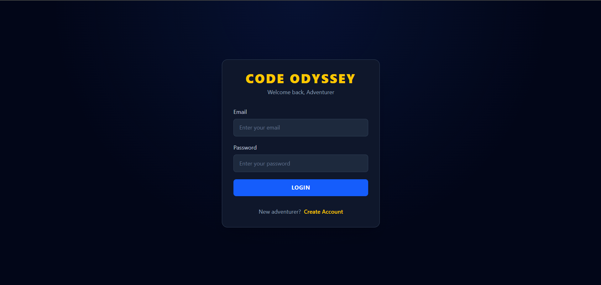
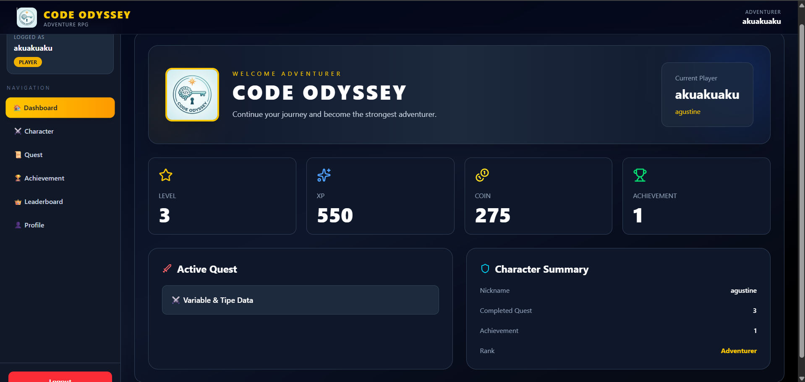
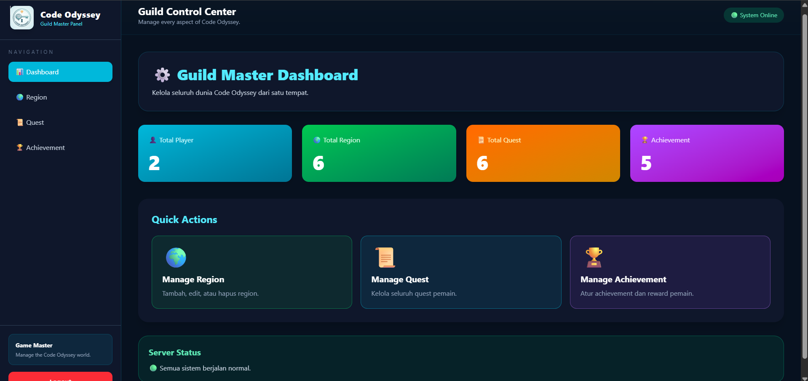

# ⚔️ Code Odyssey

Code Odyssey adalah aplikasi web berbasis gamifikasi yang membantu pengguna belajar melalui sistem quest. Pemain dapat membuat karakter, menyelesaikan quest berupa soal pilihan ganda, memperoleh XP dan Coin, naik level, serta membuka achievement.

Project ini dibuat sebagai Capstone Project Code124.

---

# ✨ Features

## 👤 Authentication
- Register
- Login menggunakan JWT
- Role Based Access (Admin & Player)

## 🎮 Character
- Membuat Character
- Melihat Profile Character
- Level System
- XP System
- Coin System

## 🗺️ Region
- Admin dapat membuat region
- Player dapat melihat region

## 📜 Quest
- Admin dapat membuat quest
- Admin dapat mengedit quest
- Admin dapat menghapus quest
- Player dapat memulai quest
- Player menjawab soal pilihan ganda
- Jawaban benar mendapat reward
- Jawaban salah langsung gagal
- Quest hanya dapat dimainkan satu kali

## 🏆 Achievement
- Achievement berdasarkan jumlah quest selesai
- Achievement berdasarkan level character

---

# 🛠️ Tech Stack

## Frontend
- React
- TypeScript
- Tailwind CSS
- React Router
- Axios
- React Hot Toast

## Backend
- Node.js
- Express.js
- Prisma ORM
- PostgreSQL
- JWT Authentication
- Zod Validation
- bcrypt

---

# 📂 Project Structure

```
CodeOdyssey
│
├── client
│   ├── src
│   ├── public
│   └── ...
│
├── server
│   ├── prisma
│   ├── src
│   └── ...
│
└── README.md
```

---

# 🗄️ Database

Database menggunakan PostgreSQL dengan Prisma ORM.

Entity utama:

- User
- Role
- Character
- Region
- Quest
- QuestReward
- QuestProgress
- Achievement
- CharacterAchievement

---

# 🚀 Installation

Clone repository

```bash
git clone https://github.com/USERNAME/CodeOdyssey.git
```

Masuk ke project

```bash
cd CodeOdyssey
```

---

## Backend

Masuk folder server

```bash
cd server
```

Install dependency

```bash
npm install
```

Buat file `.env`

```env
DATABASE_URL="postgresql://..."
JWT_SECRET="your_secret"
PORT=3000
```

Generate Prisma Client

```bash
npx prisma generate
```

Migrasi database

```bash
npx prisma migrate deploy
```

Jalankan server

```bash
npm run dev
```

---

## Frontend

Masuk folder client

```bash
cd client
```

Install dependency

```bash
npm install
```

Jalankan React

```bash
npm run dev
```

---

# 🎯 Gameplay

1. Player melakukan Register/Login.
2. Membuat Character.
3. Memilih Quest.
4. Menekan **Start Quest**.
5. Menjawab soal pilihan ganda.
6. Jika jawaban benar:
   - Quest selesai
   - Mendapat XP
   - Mendapat Coin
   - Level dapat meningkat
   - Achievement dicek
7. Jika jawaban salah:
   - Quest langsung gagal
   - Tidak mendapat reward
   - Tidak dapat mengulang quest.

---

# 👨‍💼 Admin Features

Admin memiliki akses untuk:

- CRUD Region
- CRUD Quest
- CRUD Achievement

---

# 🔐 Authentication

Menggunakan:

- JWT (JSON Web Token)
- Password Hashing dengan bcrypt

---

# ✅ Validation

Seluruh request backend divalidasi menggunakan:

- Zod

---

# 📸 DOCS

1. Login



2. Dashboard Player



3. Dashboard Admin



---

# 👨‍💻 Author

Agustinus Kurnia Candra Mahardhika

Capstone Project — Code124
